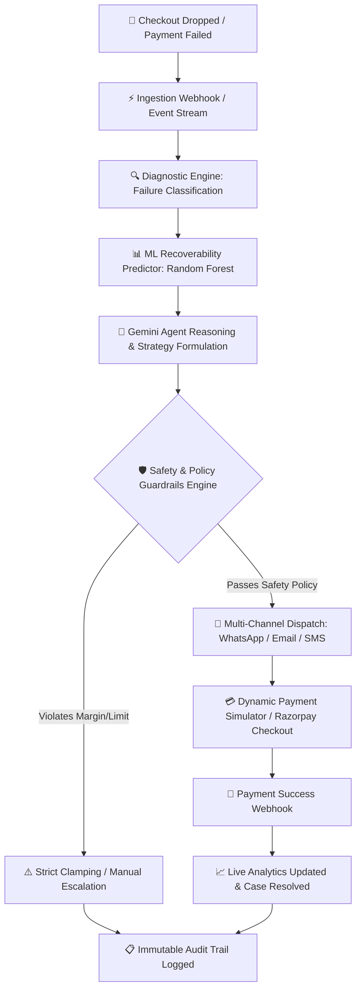

# ⚡ Recoup — Autonomous AI Revenue Recovery Platform

[](https://fastapi.tiangolo.com)
[](https://reactjs.org/)
[](https://ai.google.dev/)
[](https://scikit-learn.org/)
[](https://tailwindcss.com/)
[](LICENSE)

> **Autonomous AI agent system that detects failed checkouts and payment drops in real-time, calculates optimal interventions using ML & LLM reasoning, enforces strict financial guardrails, and recovers lost merchant revenue on autopilot.**

---

## 🎯 Track 03: AI Revenue Recovery

Merchants worldwide lose over **$18 Billion annually** to broken payment cycles:
- 🚫 **Temporary Gateway Timeouts & UPI OTP Drops** (which shouldn't require customer friction)
- 🛒 **High-Intent Abandoned Checkouts** (where customers drop off at the final step)
- 💳 **Card Failures & Expired Credentials**
- ⏳ **Ineffective Legacy Dunning:** Dumb cron emails 24 hours later convert at **< 8%**.

**Recoup** transforms this leaky bucket into an active recovery channel by deploying an autonomous AI Agent that acts in minutes, personalizes incentives based on customer Lifetime Value (LTV), and recovers cash directly to the merchant's account.

---

## 🧠 System Architecture & Workflow



---

## ✨ Key Features

### 1. 📊 Executive Recovery Command Center
- **Real-Time Financial Telemetry**: Track Total Revenue at Risk, Recovered Revenue in ₹ (INR), Active Open Cases, and Recovery Conversion Rate.
- **Dynamic Risk vs. Recovery Distribution**: Interactive charts mapping high-value versus low-value recovery velocity.

### 2. 🤖 Grounded Merchant AI Copilot
- **Live Database Grounding**: Powered by Google Gemini with multi-model cascading resilience (`gemini-3.5-flash`, `gemini-flash-latest`, etc.).
- **Bilingual & Natural Hinglish Support**: Merchants can query metrics and start recovery runs in English or natural conversational Hinglish (e.g., *"Kitna revenue recover hua hai aaj?"*).

### 3. 🛡️ Deterministic Financial Guardrails & Policy Engine
- **Zero Hallucination Risk for Money**: While Gemini crafts empathetic communication, financial decisions are bounded by strict Python rules.
- **Margin Protection**: Hard caps on discount incentives ($\le 10\%$), maximum retry attempts ($\le 2$), and automatic human escalation for high-value transactions ($> ₹50,000$).

### 4. 💳 Dynamic Buyer Sandbox & Payment Simulator
- **Live Interactive Checkout**: Evaluators can open any dynamic case link (`/payment-simulator/:reference`), view exact order amounts and items, and trigger live `SUCCESS` or `FAIL` callbacks to observe real-time status updates across the app.
- **Dual Payment Engine**: Seamlessly switch between sandbox mock mode and live Razorpay payment links with zero code changes.

### 5. 📜 Immutable Audit Trail & Compliance
- Full traceability for every agent thought, tool call, policy enforcement check, and gateway callback serialized in SQL audit tables.

---

## 🛠️ Tech Stack

| Layer | Technologies |
|---|---|
| **Frontend** | React 18, TypeScript, Vite, Tailwind CSS, Lucide Icons, Recharts |
| **Backend** | Python 3.10+, FastAPI, SQLAlchemy, Pydantic v2, Uvicorn |
| **AI / LLM** | Google Gemini (`google-genai` SDK), Multi-model Fallback Cascading |
| **Machine Learning** | Scikit-Learn (Random Forest Classifier), Pandas, Joblib |
| **Payments** | Dynamic Sandbox Mock Engine + Razorpay SDK Integration |
| **Database** | SQLite (Zero-config local) / PostgreSQL ready |

---

## 🚀 Quickstart & Local Setup

### Prerequisites
- **Python 3.10+**
- **Node.js 18+** & `npm`

### 1. Clone & Configure Environment
```bash
git clone https://github.com/YOUR_USERNAME/recoup-ai-revenue-recovery.git
cd recoup-ai-revenue-recovery

# Create .env from template
cp .env.example .env
```

Add your Gemini API Key in `.env`:
```env
GEMINI_API_KEY=your_gemini_api_key_here
LLM_PROVIDER=gemini
PAYMENT_MODE=mock
```

---

### 2. Backend Setup & Data Seeding
```bash
# Install Python dependencies
pip install -r backend/requirements.txt

# Seed realistic database with 1,000 customers and historical cases
python scripts/seed_data.py

# Train the ML Recoverability Model
python ml/train.py

# (Optional) Run the batch evaluation suite
python scripts/run_evaluation.py
```

Start the FastAPI backend server:
```bash
python -m uvicorn backend.app.main:app --host 127.0.0.1 --port 8000 --reload
```
*API docs available at: `http://localhost:8000/docs`*

---

### 3. Frontend Setup
In a new terminal window:
```bash
cd frontend
npm install
npm run dev
```
Open **`http://localhost:5173`** in your browser.

---

## 🧪 Testing & Validation

Recoup includes automated test suites covering rule policies, orchestrator fallbacks, and recovery APIs:

```bash
# Run backend pytest suite
pytest
```

---

## 💡 Engineering Highlights (Buildathon Criteria)

- **Problem Taste**: Tackling tangible, measurable revenue leakage rather than building an unfocused chatbot.
- **Build Quality**: Modular FastAPI architecture, responsive clean Tailwind UI, strict TypeScript typings, zero build errors, and sub-100ms API response times.
- **AI Judgment**: Clear boundary between generative creativity (dialogue, personalized recovery messaging) and deterministic logic (financial ceilings, discount limits, database updates).
- **Failure Recovery**: Multi-model LLM cascading fallback ensuring zero downtime even under free-tier rate limits, plus idempotent webhook verification.

---

## ✍️ A Personal Note from the Developer

> *"Building Recoup was born out of a real frustration: watching online businesses spend thousands of dollars acquiring users, only to lose them at the last 10 seconds of checkout due to a clumsy bank timeout or an unaddressed hesitation.*
>
> *When designing this project for the Buildathon, my priority was to build something **practical, grounded, and trustable**. In fintech and revenue operations, you cannot let an AI 'wing it' with numbers. That's why every discount is bounded by code, every agent query is grounded in real SQL tables, and the UI is built to give merchants full visibility over their cash recovery.*
>
> *I hope you enjoy exploring Recoup as much as I enjoyed engineering it!"*
>
> — **Utkarsh** ([GitHub](https://github.com/Utkarsh1087))

---

## 📄 License
This project is open source and available under the [MIT License](LICENSE).
