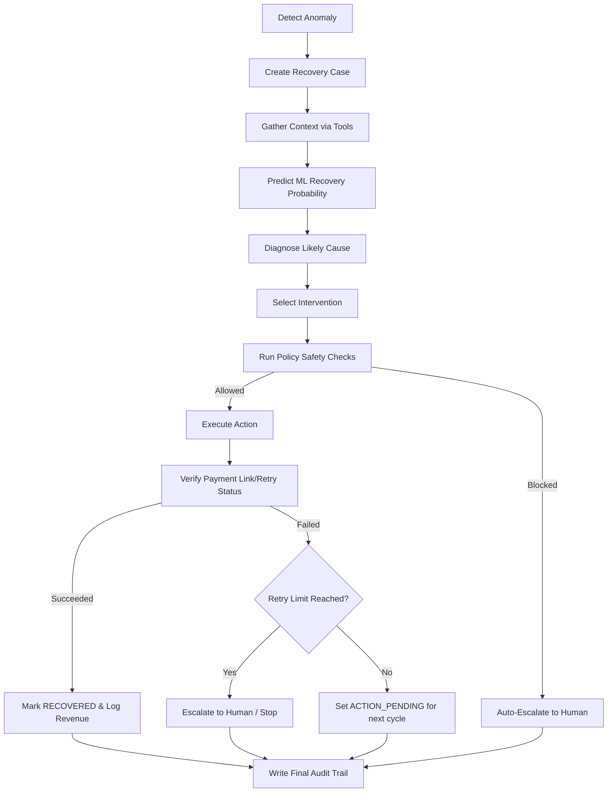

# RecoverAI — Agentic AI Orchestration & Tool Boundaries

This document details the AI Agent architecture, tool interfaces, decision workflows, and dunning safety policies.

---

## Agent Decision Flow

RecoverAI processes revenue-leakage events through a structured agent lifecycle:

---

## Safety Policies & Stop Rules

All actions suggested by the Agent must clear the central `PolicyEngine` gatekeeper before execution:

1. **Max Interventions**: A recovery case is capped at **2 automated actions** (payment retry attempts, SMS alerts, or coupon code dispatches). This prevents repeatedly messaging customers.
2. **Incentive Limits**: Coupon/discount percentages must never exceed **10.0%**. Any discount value above this limit will be blocked.
3. **High-Value Cap**: Any transaction with an amount at risk exceeding **50,000 INR** will bypass automated recovery and auto-escalate to human staff immediately.
4. **Gateway Status Check**: The agent will abort and stop if a transaction's status is already marked `SUCCESS` or the customer has cancelled active subscriptions.

---

## Agent Tool Definitions

The Agent interacts with the backend resources strictly through these python helper tools:

- `get_customer_history(customer_id: int)`: Queries customer orders, historical LTV, and payment success rates.
- `get_transaction_details(transaction_id: str)`: Fetches invoice status, amounts, and gateway failure reasons.
- `get_checkout_details(checkout_id: str)`: Inspects abandoned shopping cart items and balances.
- `get_subscription_details(subscription_id: str)`: Gathers billing cycle logs.
- `calculate_recovery_probability(case_id: int)`: Computes score using features fed into scikit-learn.
- `send_recovery_message(customer_id: int, template_name: str)`: Sends automated reminders.
- `create_payment_retry(transaction_id: str)`: Re-triggers charges on the gateway.
- `generate_payment_retry_link(transaction_id: str)`: Creates secure simulation payment checkout links.
- `offer_bounded_incentive(customer_id: int, discount_pct: float)`: Dispatches discount links.
- `escalate_to_human(case_id: int, reason: str)`: Flags case for merchant manual review.
- `stop_recovery(case_id: int, reason: str)`: Pauses agent and terminates workflow.
